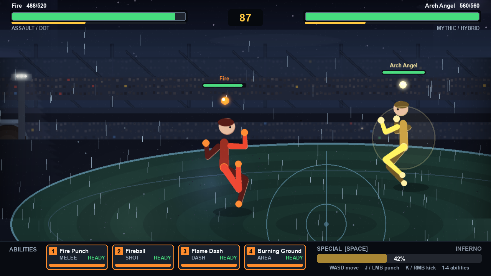

# Spirit Fighters

A 2D stick-figure arena fighter, built in Python with pygame. Nine spirits, each
with four abilities and an ultimate, fighting in a floodlit stadium in the rain.

Everything you see is generated in code — there are no image or sound files
anywhere in this repo. The stadium, the fighters, the rain and every sound effect
are drawn or synthesised at startup.



## Play

```bash
pip install pygame numpy
python3 spirit_fighters.py
```

`numpy` is optional; without it the game runs silently.

### Browser build (experimental)

The game also compiles to WebAssembly with [pygbag](https://pypi.org/project/pygbag/):

```bash
pip install pygbag
python3 -m pygbag --build --ume_block 0 .
```

Output lands in `build/web` as static files. **This is not yet confirmed
working** — the bundle builds and deploys, but the pygbag loader has not been
seen to finish booting, and even once it does, this renderer is heavy (a
1600x900 world, six parallax layers, a supersampled figure pass and a
multi-stage post chain) so a browser may not hold 60fps. The desktop build is
the one to rely on.

pygbag's loader wants a cross-origin-isolated context, which GitHub Pages
cannot provide; `netlify.toml` sets the required COOP/COEP headers.

### Controls

| Key | Action |
|---|---|
| `WASD` | Move |
| `J` or left-click | Punch |
| `K` or right-click | Kick |
| `1` – `4` | Abilities |
| `SPACE` | Ultimate (once the meter is full) |
| `ESC` | Back |

On the menu: `A`/`D` pick your spirit, `ENTER` starts the fight, `S` opens the
shop, and `F` cycles difficulty between **EASY**, **NORMAL** and **HARD**.

`F3` shows a frame-time readout. `F4` draws the skeleton and foot-plant points,
which is the clearest way to see how the walk works.

## The spirits

| Spirit | Role |
|---|---|
| Earth | Tank / control |
| Fire | Assault / damage over time |
| Police | Control / disable |
| Gambler | Trickster / RNG |
| Arch Angel | Mythic / hybrid |
| Demonic | Assassin / lifesteal |
| Archer | Ranged / precision |
| Healer | Support / sustain |
| Racer | Speed / hit and run |

The shop has 18 upgrades that stack — damage, lifesteal, cooldown reduction and
so on. Everything is free while `DEV_MODE` is on. Your loadout is saved between
runs and applied at the start of each match.

**On balance:** matches run about 20 seconds and most spirits win between 40%
and 100% of their matchups against the AI on NORMAL. Racer is the outlier and
still underperforms in automated testing — though that testing uses a bot that
walks into melee and trades, which is the worst possible way to play a hit-and-run
character. If a matchup feels unfair, `F` on the menu drops the difficulty.

## How it works

The interesting parts are mostly about motion and depth.

**The figures are rigged, not posed.** Each fighter has a skeleton with two-bone
IK for the arms and legs. Feet claim a point on the ground and hold it — a
planted foot does not move by so much as a pixel while the hips travel over it,
and a new step is triggered when the hips outrun the planted foot. If a foot ends
up further away than the leg can reach, the hips sink into a lunge rather than
letting the foot detach. Damped springs on the spine, head and chest give limbs
overshoot and settle, so hits shove the body around instead of snapping it.
Death blends from the animated pose into a verlet ragdoll over 150 ms.

**The stadium is six layers deep.** Sky, upper deck, main tier, lower bowl,
pitch, and a barrier rail that passes in front of the fighters. Each moves at its
own rate as the camera pans, and distant layers are washed toward a haze colour
and softened so depth reads even in a still frame.

**The camera follows the fight.** It tracks the midpoint with a deadzone, leads
the fighters' velocity, and frames wider as they separate — about 1.14× zoom in a
clinch, 0.81× when they are at opposite ends.

**Simulation runs at a fixed 120 Hz** regardless of framerate, so the springs and
the ragdoll behave identically on any machine.

There is a post chain — bloom off a dedicated emissive buffer, colour grade,
vignette, film grain — all deliberately subtle.

## Tuning

Every adjustable number lives in the `CFG` block at the top of the file. The ones
worth playing with first:

| Key | Does |
|---|---|
| `CFG.game.ai_skill` | How hard the opponent fights |
| `CFG.fx.weather` | `"rain"`, `"snow"` or `"none"` |
| `CFG.post.bloom` | Glow strength |
| `CFG.post.grain` | Film grain |
| `CFG.feel.accel` | How quickly fighters get moving |
| `CFG.camera.view_min` / `view_max` | How tight the camera frames |

## Tests

```bash
SF_SELFTEST=1 python3 spirit_fighters.py
```

Runs headless. It exercises all nine spirits' abilities and ultimates, both basic
attacks, the shop, and a full match through to the result screen.

## Performance

About 8.6 ms per frame against a 16.67 ms budget for 60 fps, measured headless on
an M-series Mac. Verified flat over 12,000 continuous frames — no leaks, particle
count steady, caches bounded.

## Licence

MIT — see [LICENSE](LICENSE).
